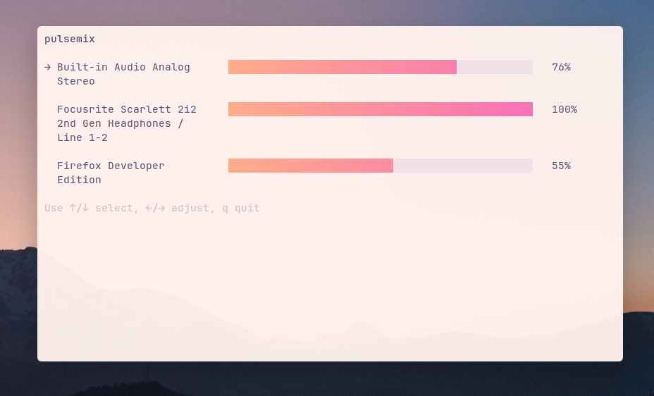

# pulsemix

A lightweight, beautiful CLI mixer for PulseAudio, with gradient sliders, wrapped names, and flicker-free updates.

## Features

- Dynamic sinks and applications
- Gradient volume bars with subtle background
- Word-wrapped names, aligned sliders
- Selector arrows and spacing for readability
- Minimal flicker even on volume updates
- Fully themeable using hex colors

## Screenshot

Here's pulsemix up & running on Kitty terminal (DawnFox theme):



## Setup (Development)

1. Clone the repository:

```
git clone git@github.com:tomsqra/pulsemix.git
cd pulsemix
```

2. Create and activate a virtual environment:

```
python3 -m venv .
source bin/activate
```

3. Install dependencies:

```
pip install -r requirements.txt
```

4. Run the app:

```
python main.py
```

## Generate a standalone binary

Using PyInstaller (included in `requirements.txt`):

```
pyinstaller --onefile --name pulsemix main.py
```

The executable will be in `dist/pulsemix`.

You can move it to `/usr/local/bin` or any other folder for global access:

```
sudo cp dist/pulsemix /usr/local/bin/
pulsemix
```

## Usage

- Use ↑/↓ to select sinks/inputs
- Use ←/→ to adjust volume
- q to quit

## License

BSD-3-Clause license

but honestly, don't care about it... copy and distribute freely

